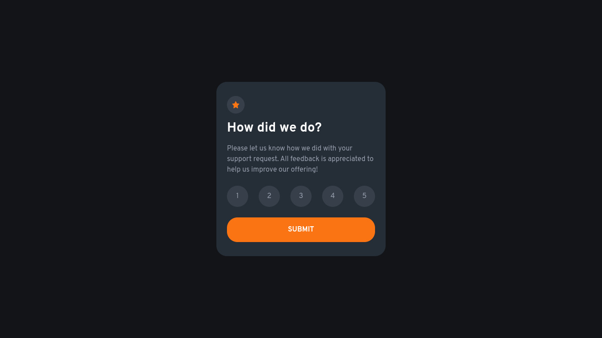
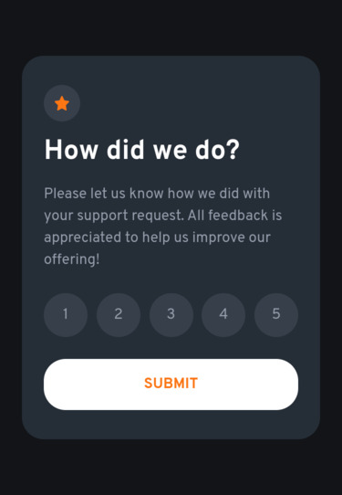

# Frontend Mentor - Interactive rating component solution

This is a solution to the [Interactive rating component challenge on Frontend Mentor](https://www.frontendmentor.io/challenges/interactive-rating-component-koxpeBUmI). Frontend Mentor challenges help you improve your coding skills by building realistic projects. 

## Table of contents

- [Frontend Mentor - Interactive rating component solution](#frontend-mentor---interactive-rating-component-solution)
  - [Table of contents](#table-of-contents)
  - [Overview](#overview)
    - [Screenshot](#screenshot)
    - [Links](#links)
  - [My process](#my-process)
    - [Built with](#built-with)
    - [What I learned](#what-i-learned)
    - [Continued development](#continued-development)
    - [Author](#author)

## Overview

### Screenshot

Desktop View

Mobile View

### Links

- [Solution URL](https://github.com/reza-sjdn/interactive-rating-component)
- [Live Demo](https://reza-sjdn.github.io/interactive-rating-component)

## My process

### Built with

- Semantic HTML5 markup
- CSS custom properties
- Flexbox
- Mobile-first workflow
- [Tailwindcss](https://tailwindcss.com/) - Tailwindcss framework

### What I learned

This was my first challenge applying my Javascript and HTML-DOM knowledge.
Naturally, It's not perfect and cleen but i promise to uplift myself!

### Continued development

I must go deeper in HTML-DOM. That's it.

### Author

- Frontend Mentor - [@reza-sjdn](https://www.frontendmentor.io/profile/reza-sjdn)
- Twitter - [@reza_sjdn](https://www.twitter.com/reza_sjdn)
- Telegram - [@reza_sjdn80]
